# 跨性别社群活动平台 — 交接文档

> 私域 · 邀请制 · 隐私可控的跨性别社群活动平台
> 当前进度：MVP 全栈完成 + 浏览器验证通过
> 最后更新：2026-05-09

---

## 一分钟速览

这是一个面向跨性别社群的私域活动发布与报名平台，参考 Plan House 的产品形态：
- **不公开搜索** — 所有受护页面 noindex，只对登录成员开放
- **邀请制 + 申请审核双通道** — 决定谁能进
- **按信任分层** — GUEST / UNVERIFIED / VERIFIED / TRUSTED / ADMIN 五级
- **不做私信** — 避免成为骚扰温床
- **联系方式可见性按需开放** — 公开 / 认证可见 / 信任可见 / 申请才可见
- **线下精确地址、线上会议链接永远只对报名通过的成员可见**

技术栈：Next.js 14 (App Router) + TypeScript + Prisma + Tailwind + Auth.js v5 + shadcn 风格的自研组件。

---

## 视觉概览

### 1. 首页（游客视角）

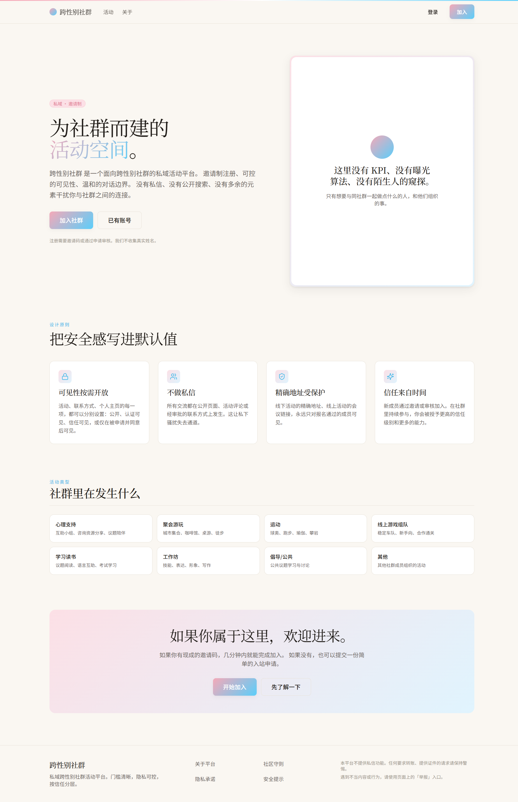

- 顶部细线：粉→白→蓝渐变 hairline（跨性别旗）
- Hero：`私域 · 邀请制` 徽章 + 衬线大标题（"活动空间"用粉蓝渐变文字）+ 右侧粉蓝软渐变卡片
- "把安全感写进默认值" 4 原则
- 8 个活动分类卡片
- 底部 CTA 区（粉蓝软渐变）

### 2. 关于平台

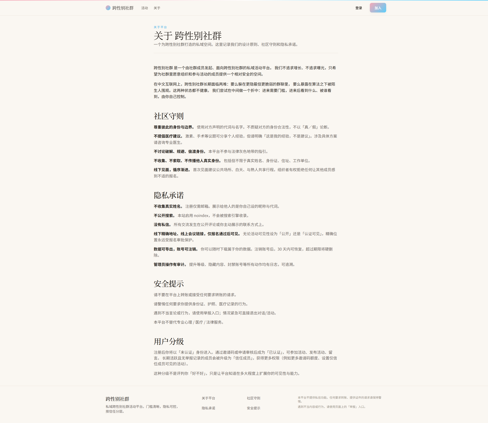

社区守则、隐私承诺、安全提示、用户分级四节，prose 排版，editorial 报刊风。

### 3. 注册（双通道）

| 邀请码 | 申请审核 |
|---|---|
| 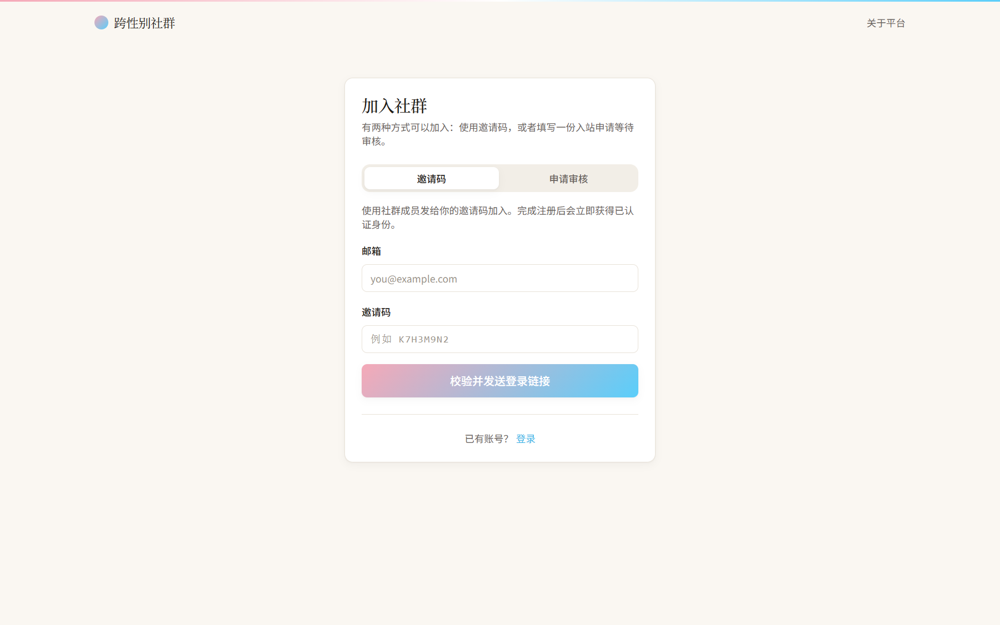 | 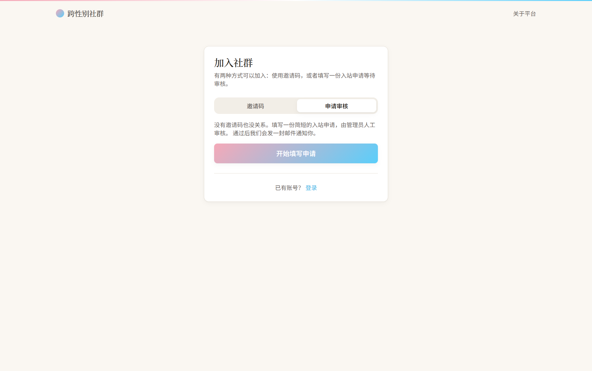 |

### 4. 入站申请表单

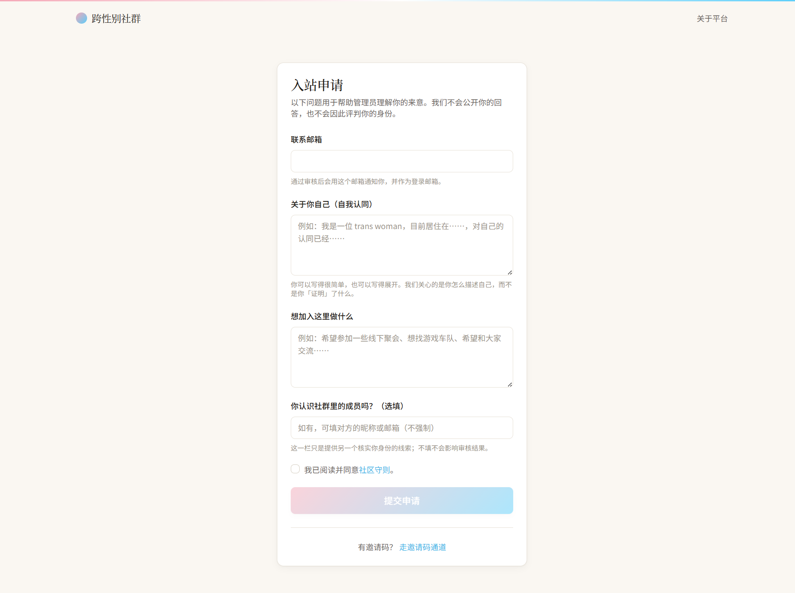

四题问卷：邮箱 / 自我认同 / 来意 / 熟识成员（选填） + 同意社区守则。

### 5. 登录

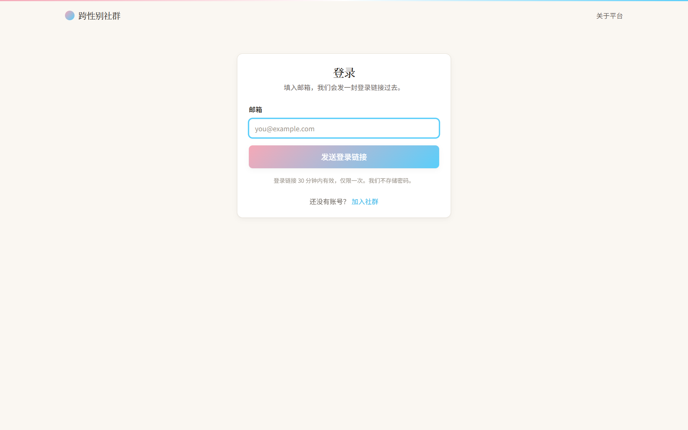

邮箱魔法链接，30 分钟内有效，不存密码。

### 6. /me 概览（已登录）

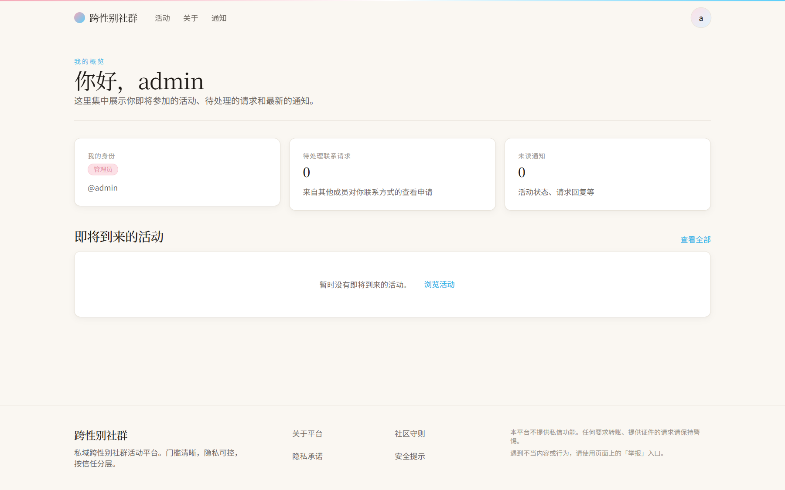

衬线问候 + 3 状态卡（身份 / 待处理请求 / 未读通知）+ 即将到来的活动列表。

### 7. 编辑主页

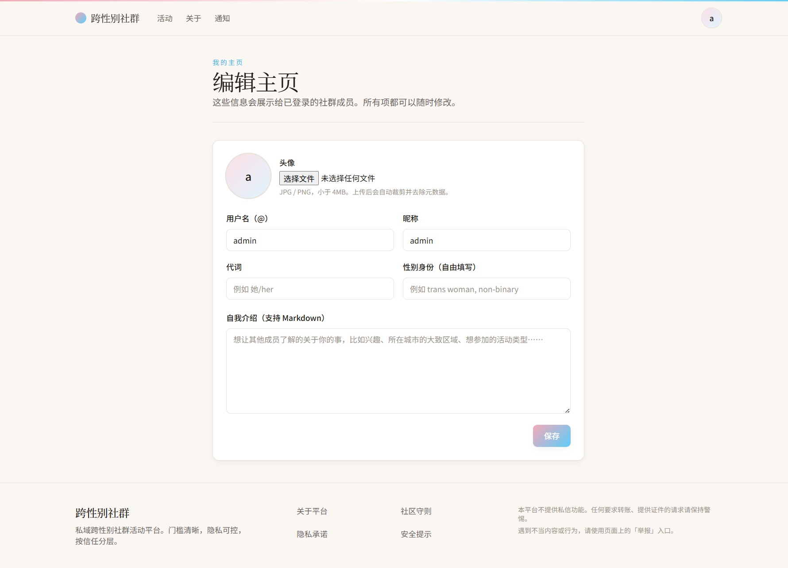

handle / 昵称 / 代词 / 性别身份（自由填写） / Markdown bio + 头像上传（自动 EXIF 抹除）。

### 8. 用户主页

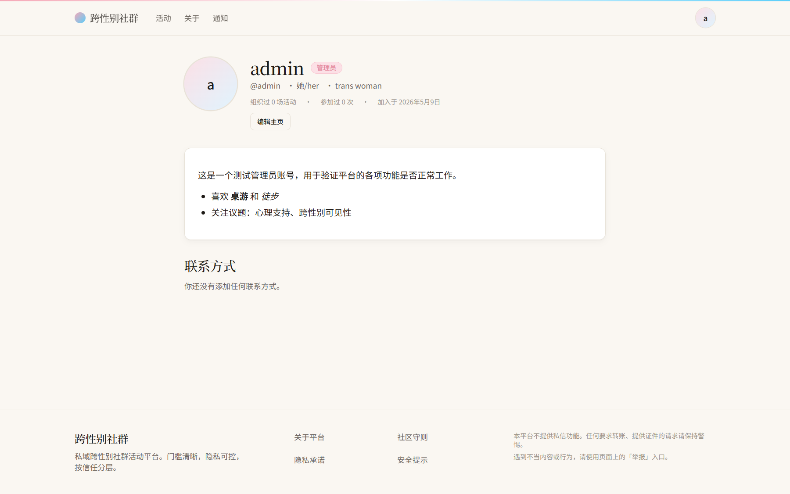

Markdown bio 已渲染（粗体、斜体、列表）；联系方式区按可见性条件渲染。

### 9. 邀请码

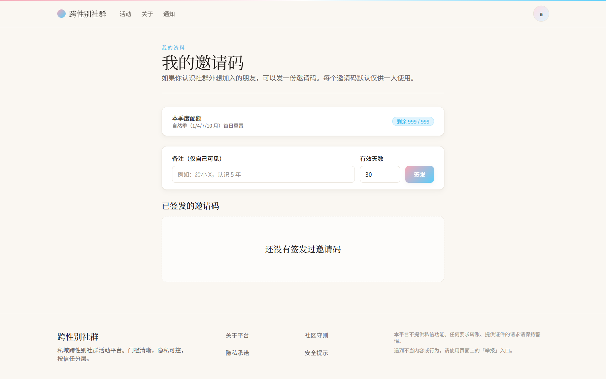

季度配额（VERIFIED 2 / TRUSTED 5 / ADMIN 999），命名空间隔离，一码一用。

### 10. 活动详情（admin 自己的）

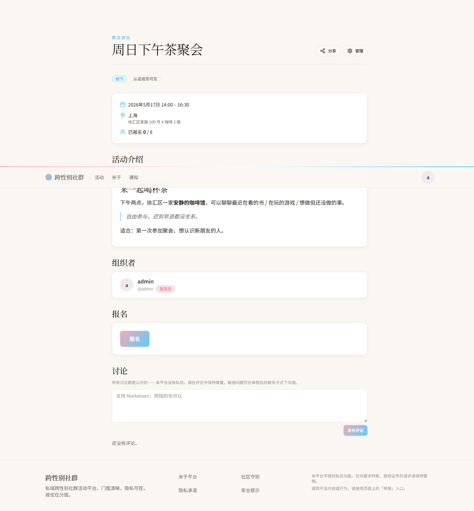

- eyebrow `聚会游玩` + 衬线大标题
- 顶部 `分享 / 管理` 按钮组
- 徽章：`线下` `认证成员可见`
- 时间、地点（粗略 + 精确）、报名进度
- markdown 介绍（H2、加粗、引用块、列表都正确渲染）
- 组织者卡片
- 报名 + 评论框

### 11. 分享 Dialog（双 tab）

| 站内推荐 | 站外分享 |
|---|---|
| 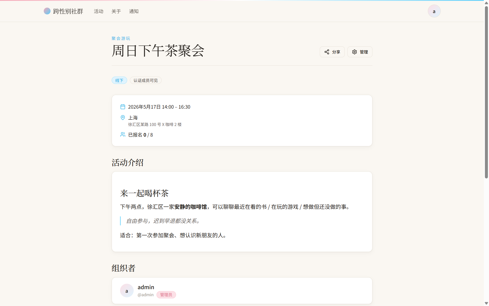 | 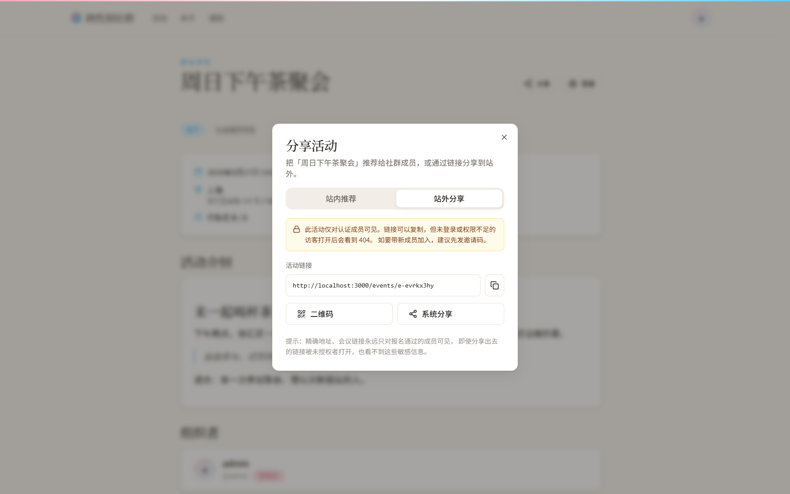 |

- 站内：handle 模糊搜索，多选最多 10，限频 10次/小时，无自定义留言
- 站外：链接 / 二维码 / 系统分享面板。非公开活动会用琥珀色警示条提醒访客打开会 404。

### 12. 管理后台

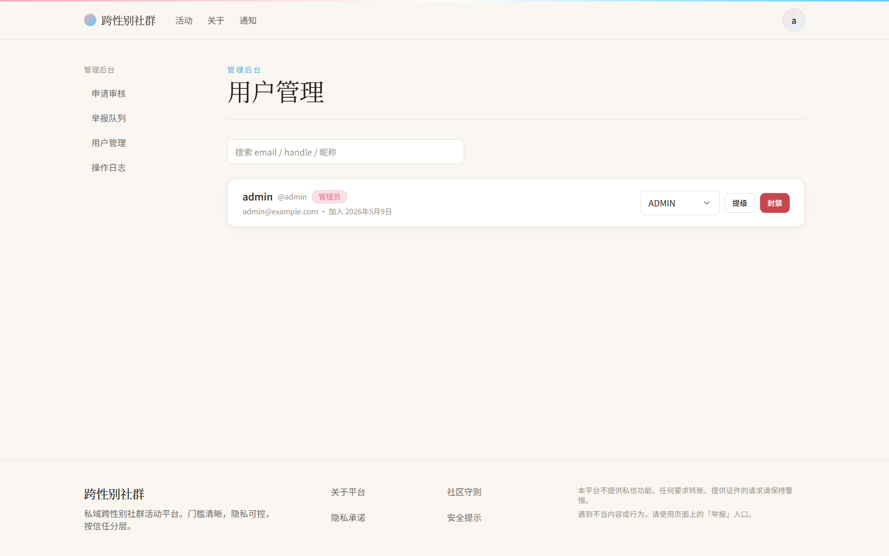

双栏布局：左侧导航（申请审核 / 举报队列 / 用户管理 / 操作日志）+ 右侧内容；提级 / 封禁按钮就地操作。

### 13. 移动端响应式

| 首页 | 活动列表 |
|---|---|
| 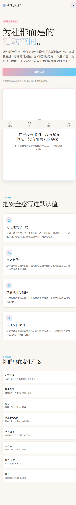 | 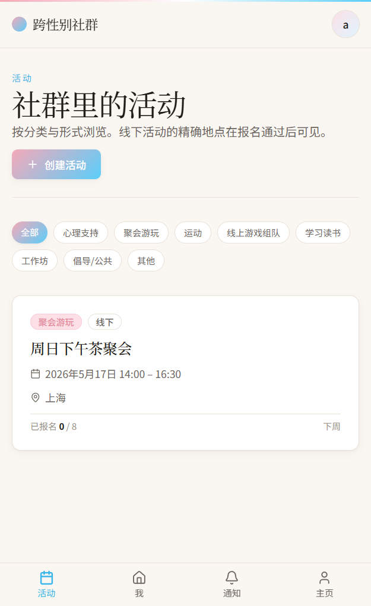 |

- 卡片单列堆叠
- 分类胶囊换行
- 已登录后底部固定 4 项 tab bar（活动 / 我 / 通知 / 主页）

---

## 启动与开发

### 环境要求
- Node.js 20+
- pnpm 10+（npm/yarn 也行，但 lock 文件是 pnpm 的）

### 三步启动
```powershell
# 1. 装依赖（首次）— 国内建议先切镜像
pnpm config set registry https://registry.npmmirror.com
pnpm install --network-concurrency=4

# 2. 数据库 + 种子（首次）
cp .env.example .env.local
cp .env.example .env       # Prisma CLI 只读 .env
pnpm db:migrate            # 应用迁移
pnpm create-admin you@example.com   # 创建首位管理员

# 3. 启动
pnpm dev                   # http://localhost:3000
```

### 常用命令
| 命令 | 作用 |
|---|---|
| `pnpm dev` | 启动开发服务器 |
| `pnpm build` | 生产构建 |
| `pnpm typecheck` | TS 类型检查 |
| `pnpm lint` | ESLint |
| `pnpm db:migrate` | 应用 Prisma 迁移 |
| `pnpm db:studio` | Prisma Studio（浏览数据） |
| `pnpm db:reset` | **销毁并重建数据库** |
| `pnpm db:seed` | 跑种子脚本 |
| `pnpm create-admin <email>` | 创建/提级 ADMIN |
| `pnpm issue-invite [--note "x"] [--days 30]` | 命令行签发邀请码 |
| `pnpm tsx scripts/dev-session.ts <email>` | dev-only：mint 一个 session token |

### Dev-only 调试登录
邮箱魔法链接在本地开发时**不发邮件**（控制台打印链接即可），但 `/api/dev/sign-in?email=admin@example.com` 这条路由能直接 mint cookie 跳过链接环节。该路由生产环境强制 404，本地 `NODE_ENV !== "production"` 时才工作。

---

## 数据库现状（重要！）

**当前是 SQLite，仅供本地验证。生产部署前必须切回 Postgres。**

### 为什么用 SQLite
本地验证时没装 Postgres / Docker，临时切到 SQLite 跑通完整闭环。

### 切换路径（→ Postgres）
1. **`prisma/schema.prisma`**：把 `provider = "sqlite"` 改回 `"postgresql"`
2. **加回 enum 块**：把 `String` 类型的字段改回 enum（值见 `src/lib/enums.ts`，那里是 source of truth）
3. **去掉 String 化的 Json**：把 `answers / payload / customQuestions / meta / answers` 改回 `Json` / `Json?`
4. **去掉 JSON.stringify/parse**：所有用了 `jsonEncode` / `jsonDecode` 的地方改成直接传/取对象（约 10 处）
5. **加回 `@db.Text`**：长文本字段（`description`、`body`、`reason`、Auth.js 的 token 字段）
6. **可选：加回 `mode: "insensitive"`**：搜索不区分大小写（admin/users、events 列表、share-actions 共 6 处）
7. **重新跑 `pnpm db:migrate`** 生成新迁移

### Schema 双向兼容点
我已经把 enum 的 string 值在 `src/lib/enums.ts` 集中定义，运行时值跟 Prisma 生成的 enum 完全一致。所以业务代码不需要改，只是 schema 与 schema 周边的少量代码需要回写。

### 别忘了
- **删除 SQLite migration**：`prisma/migrations/20260509043339_init/` 这个是 SQLite 版本的，切 Postgres 后要删，重新生成
- **删除 `dev.db` 文件**（如果有）

---

## 架构地图

### 关键目录

```
src/
├─ app/
│  ├─ (marketing)/         # 公开页面（首页、关于）
│  ├─ (auth)/              # 登录、注册、申请
│  ├─ (app)/               # 受保护应用区（layout 调 requireUser）
│  │  ├─ events/           # 活动 CRUD + 报名 + 评论 + 分享
│  │  ├─ me/               # 个人中心
│  │  ├─ u/[handle]/       # 用户主页
│  │  └─ notifications/
│  ├─ admin/               # 管理后台（layout 调 requireTier("ADMIN")）
│  └─ api/
│     ├─ auth/[...nextauth]/   # Auth.js 路由
│     ├─ files/[...path]/      # 本地文件读取（avatar 等）
│     └─ dev/sign-in/          # dev-only 登录辅助
├─ components/
│  ├─ ui/                  # 基础组件（Button / Input / Dialog / ...）
│  ├─ event/               # EventCard, EventForm, ShareEventButton...
│  ├─ user/                # TierBadge, ProfileMarkdown...
│  ├─ moderation/          # ReportButton + actions
│  └─ layout/              # AppShell, TopBar, MobileNav, Footer
├─ lib/
│  ├─ db.ts                # Prisma client 单例
│  ├─ auth.ts              # Auth.js 配置 + 入站邀请码消费
│  ├─ session.ts           # getCurrentUser / requireUser / requireTier
│  ├─ access/              # 权限断言 + Prisma where 过滤器
│  ├─ enums.ts             # 字符串字面量联合（替代 Prisma enum）
│  ├─ json.ts              # SQLite JSON 字段读写包装
│  ├─ env.ts               # 环境变量集中读取
│  ├─ utils.ts             # cn / formatDateTime / slugify / randomCode
│  ├─ mail/sender.ts       # Resend / SMTP / 控制台 三种邮件发送方式
│  ├─ moderation/          # 关键词过滤
│  ├─ storage/             # 本地 fs / S3 兼容 抽象
│  └─ validators/          # Zod schemas（前后端共用）
├─ emails/                 # React Email 模板（6 封）
├─ middleware.ts           # 全局路由保护
└─ styles/globals.css      # 主题 + prose 自定义
prisma/
├─ schema.prisma
└─ migrations/             # 当前是 SQLite 版
scripts/
├─ create-admin.ts         # 命令行创建/提级 admin
├─ issue-invite.ts         # 命令行签发邀请码
└─ dev-session.ts          # 命令行 mint dev session
```

### 数据模型核心
13 个 Prisma 模型：
- **User** + **Account** / **Session** / **VerificationToken**（Auth.js 适配器）
- **InviteCode** / **Application**（准入双通道）
- **ContactMethod** / **ContactRequest**（联系方式 + 申请查看）
- **Event** / **Registration** / **Comment**（活动闭环）
- **Report** / **Block**（审核与安全）
- **Notification** / **AuditLog**

### 用户分级权限矩阵

| Tier | 浏览 | 报名 | 评论 | 发布活动 | 管理 |
|---|---|---|---|---|---|
| **GUEST** 游客 | 仅 PUBLIC 概要 | × | × | × | × |
| **UNVERIFIED** 已登录未认证 | 同游客 + 申请状态 | × | × | × | × |
| **VERIFIED** 已认证 | + VERIFIED 范围 | √ | √ | √ | × |
| **TRUSTED** 信任成员 | + TRUSTED 范围 | √ | √ | √ | 部分 |
| **ADMIN** 管理员 | 全部 | √ | √ | √ | √ |

权限断言全部集中在 `src/lib/access/index.ts`，pages / API / actions 都通过这里检查。

### 邀请码配额（按季度）
- VERIFIED: 2/季度
- TRUSTED: 5/季度
- ADMIN: 999/季度

---

## 隐私设计要点

1. **昵称即默认身份**：不收集真实姓名，handle 与 displayName 都可改
2. **noindex**：所有页面禁止搜索引擎收录
3. **联系方式默认 VERIFIED 可见**，新增项不对游客开放
4. **HIDDEN_REQUEST 类型**：他人主页显示锁状态，需填写理由（≥20字）申请，对方 Yes/No
5. **精确地址 + 会议链接**：`canViewEventDetails` 限制为「报名 CONFIRMED 才可见」，组织者和 ADMIN 例外
6. **审计日志**：所有 admin 操作（提级 / 封禁 / 隐藏 / 处理举报）写入 `AuditLog`
7. **数据导出 + 注销**：`/me/settings` 提供 JSON 导出 + 30 天软删
8. **图片上传**：Magic-byte 校验 + 重压缩 + EXIF 抹除（`sharp`）
9. **关键词过滤**：`lib/moderation/keywords.ts`，命中后 action 拒绝写入
10. **限频**：举报 5/10min、站内分享 10/小时、申请查看联系方式有限频

---

## 已修复的 bug

### 1. 中文 slug → URL 编码不一致 → 详情页 404
- 现象：用中文标题创建活动后，URL 变成 `/events/%E5%91%A8...`，metadata 能找到但 page 报 404
- 原因：Next.js 14 App Router 不同上下文里 `params.slug` 编/解码不一致
- 修法：`slugify` 限定 ASCII，非 ASCII 标题 fallback 到 `e-{8位随机}` 短码

### 2. SQLite 不支持 enum / Json / mode:insensitive
- 全部已适配，详见上面的"切回 Postgres"章节

### 3. ESLint 9 与 Next 14 不兼容
- ESLint 已 pin 到 8.57.1

### 4. EventForm 日期类型推断
- `Initial` 类型从 `Partial<FormState> & {...}`（导致 `string & Date` = never）改成 `Omit<...> & {...}`

---

## 待你定的开放项

| # | 项 | 现状 | 建议 |
|---|---|---|---|
| 1 | 组织者能给自己活动报名 | 当前允许 | 看产品决策；Plan House 默认允许 |
| 2 | 分享按钮文案 "推荐给 位成员" 中间空白 | 未选人时 disabled | 改成 disabled + "请先选择成员" |
| 3 | 数据库 | SQLite 仅本地 | 上线前切 Postgres |
| 4 | 邮件渠道 | 控制台打印 | 配 RESEND_API_KEY 或 SMTP_* |
| 5 | 文件存储 | 本地 fs | 生产建议接 S3/R2 |
| 6 | 活动定时提醒 | 未实现 | schema + 模板已就绪，需接 cron |
| 7 | E2E 测试 | 仅手工验证 | Vitest + Playwright 已配 |
| 8 | 多城市 | 未做 | 当前只有 city 字段；做"上海站""北京站" 子域要 schema 改动 |
| 9 | 活动审核 | 未做 | 当前任意 VERIFIED 可发；要预审就在 events.status 加 PENDING_REVIEW |
| 10 | 申请问卷题目 | 4 题占位 | 跟运营定具体题目 |

---

## 部署 checklist

切回 Postgres 之后：

- [ ] 申请域名 + DNS（建议海外或 HK，避开 ICP 备案对私域社群的合规风险）
- [ ] 准备 Postgres 实例（Neon / Supabase / 自建）
- [ ] 设置环境变量
  - [ ] `DATABASE_URL`（Postgres 连接串）
  - [ ] `AUTH_SECRET`（`openssl rand -base64 32`）
  - [ ] `AUTH_URL`（你的域名）
  - [ ] `RESEND_API_KEY`（邮件）
  - [ ] `STORAGE_DRIVER=s3` + `S3_*`（文件）
  - [ ] `ADMIN_EMAILS`（首批管理员）
- [ ] `pnpm db:migrate deploy`
- [ ] `pnpm create-admin <real-admin-email>`
- [ ] 配置 cron 触发活动 24h 提醒（`/api/cron/event-reminders`，待实现）
- [ ] 配置定时硬删过期账号（30 天后清理 SUSPENDED 且 `scheduledDeletionAt < now`，待实现）

---

## 联系方式可见性 4 级速览

| 值 | 含义 | 谁能看到 |
|---|---|---|
| `PUBLIC` | 公开 | 所有访客（含未登录） |
| `VERIFIED` | 认证可见 | VERIFIED+ 成员（默认值） |
| `TRUSTED` | 信任可见 | TRUSTED+ 成员 |
| `HIDDEN_REQUEST` | 申请才可见 | 申请并经本人同意的成员 |

切换在 `/me/contacts` 添加/编辑时设置，每条联系方式独立生效。

---

## 验证状态

| 阶段 | 状态 |
|---|---|
| TypeScript typecheck | ✓ 全绿 |
| Next.js production build | ✓ 26 路由全部编译 |
| ESLint | ✓ 0 warning |
| 公开页面（home / about / sign-in / sign-up / apply） | ✓ 渲染正常 |
| 中间件未登录重定向 | ✓ 全部跳 /sign-in |
| 已登录页面（me 全套 + 用户主页） | ✓ 渲染 + 表单提交都通过 |
| 创建活动 + 详情 + 分享 dialog | ✓ 全流程跑通 |
| Admin 后台 | ✓ 用户管理可用 |
| 移动端 375x812 响应式 | ✓ 卡片堆叠 + 底部 tab bar |

详细截图见 `verify-screenshots/01..19.png`。

---

## 联系

任何疑问可在代码里搜 `TODO` / `FIXME`，或直接看：
- 设计原则：[`README.md`](README.md)
- 计划文档：[`C:\Users\mycyg\.claude\plans\1-plan-house-clever-pancake.md`](.) （决策与原始 schema 草案）
- 用户分级 / 权限：`src/lib/access/index.ts`
- 邮件模板：`src/emails/`
- Schema：`prisma/schema.prisma`
